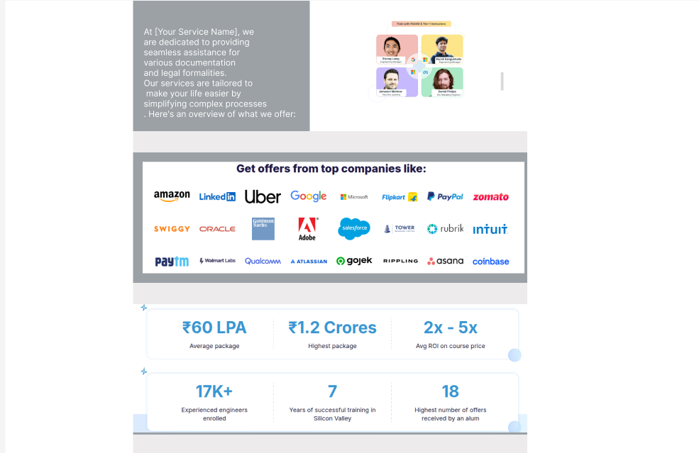
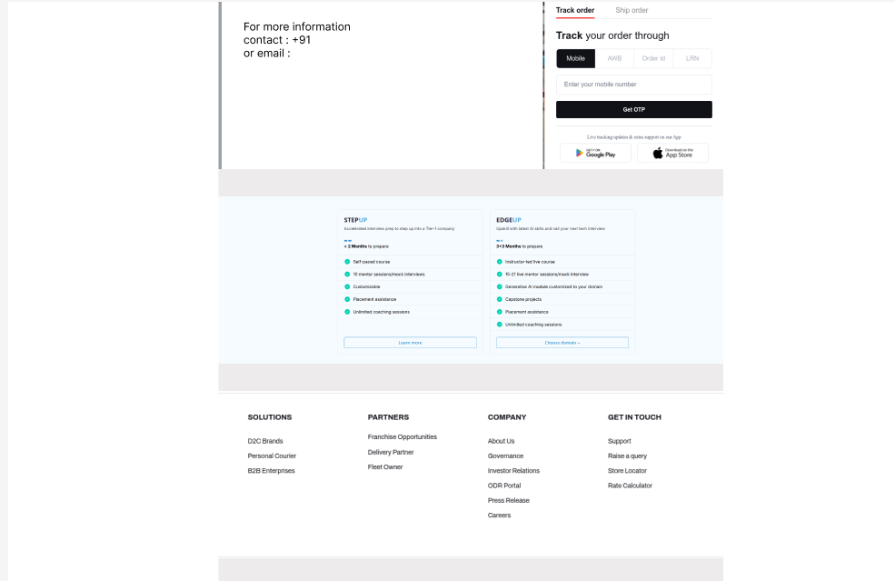

# Project: sm_enterprises

## Description

SM Enterprises is developing a JavaScript-based platform designed to streamline the application processes for essential services, including PAN, Aadhaar, Shop Act, and Udyam Registration. This user-friendly interface aims to simplify service access, enhance user experience, and ensure secure handling of personal information, thereby promoting efficiency and transparency in service delivery.

## Objectives

- **User-Friendly Interface**: Develop an intuitive and accessible platform that enables users to easily navigate and complete service applications.

- **Comprehensive Service Integration**: Consolidate multiple services (PAN, Aadhaar, Shop Act, Udyam Registration) into a single platform, streamlining the application process for users.

- **Secure Data Handling**: Implement robust security measures to protect user data during collection, storage, and transmission, ensuring compliance with relevant data protection regulations.

- **Efficient Application Processing**: Optimize backend processes to ensure timely and accurate processing of user applications, reducing turnaround times.

- **Regulatory Compliance**: Ensure that the platform adheres to all relevant government regulations and guidelines for each service offered.

- **Scalability and Performance**: Design the platform to handle increasing user loads without compromising performance, ensuring a seamless experience during peak times.

- **Responsive Design**: Ensure the platform is accessible across various devices and screen sizes, providing a consistent user experience on desktops, tablets, and smartphones.

- **Continuous Improvement**: Establish mechanisms for user feedback to facilitate ongoing enhancements and updates to the platform.

- **Educational Resources**: Provide users with clear instructions and resources to assist them in understanding and completing their applications accurately.

- **Customer Support Integration**: Offer accessible customer support options, such as chatbots or helpdesks, to assist users with inquiries or issues during the application process.

# Text-Tech:

- **Front-End**: HTML, CSS, JavaScript
- **Back-End**: Node.js, Express.js
- **Database**: MySQL
- **UI & UX Design**: Figma
- **Hosting**: [      ]

# SM Enterprises Project Timeline

Embarking on the "SM Enterprises" project within a 40-day timeframe, while simultaneously learning Node.js, Express.js, and Figma, is an ambitious yet achievable goal. Given your existing knowledge of HTML, CSS, JavaScript, and MySQL, a structured plan will help you manage both learning and development effectively. Here's a suggested timeline to guide you through this process:

## Week 1 (Days 1-7): Foundation and Learning

- **Days 1-3: Introduction to Node.js and Express.js**
  - Set up your development environment.
  - Learn the basics of Node.js and Express.js.
  - Build simple server-side applications to understand routing and middleware.

- **Days 4-5: Introduction to Figma**
  - Familiarize yourself with Figma's interface and tools.
  - Explore design principles and best practices.

- **Days 6-7: Project Planning**
  - Define project requirements and features.
  - Create wireframes and initial UI designs using Figma.

## Week 2 (Days 8-14): Backend Development

- **Days 8-11: Database Design and Integration**
  - Design your MySQL database schema based on project requirements.
  - Connect your Node.js application to the MySQL database.
  - Implement basic CRUD (Create, Read, Update, Delete) operations.

- **Days 12-14: API Development**
  - Develop RESTful APIs using Express.js to handle client requests.
  - Test your APIs to ensure they work as intended.

## Week 3 (Days 15-21): Frontend Development

- **Days 15-18: UI Implementation**
  - Translate your Figma designs into HTML and CSS.
  - Ensure responsiveness across different devices.

- **Days 19-21: Client-Side JavaScript**
  - Enhance user interactions using JavaScript.
  - Integrate frontend with backend APIs for dynamic data rendering.

## Week 4 (Days 22-28): Advanced Features and Testing

- **Days 22-25: Additional Features**
  - Implement user authentication and authorization.
  - Add any other advanced features as per project scope.

- **Days 26-28: Testing**
  - Conduct thorough testing of both frontend and backend components.
  - Fix bugs and optimize performance.

## Week 5 (Days 29-35): Deployment and Final Touches

- **Days 29-31: Deployment Preparation**
  - Prepare your application for deployment.
  - Choose a hosting service and set up the environment.

- **Days 32-35: Deployment**
  - Deploy your application to the chosen hosting platform.
  - Perform post-deployment testing to ensure everything works correctly.

## Week 6 (Days 36-40): Review and Buffer

- **Days 36-38: Documentation**
  - Create comprehensive documentation for your code and application.

- **Days 39-40: Buffer Days**
  - Use these days to address any unforeseen issues or delays.

## Additional Resources

- **Node.js and Express.js Learning:**
  - Consider following structured learning plans, such as the "30 Days of Node" tutorial series, which offers practical, project-based learning experiences.

- **Figma Tutorials:**
  - Explore Figma's official resources and community tutorials to get up to speed with UI/UX design principles.

## Tips for Success

- **Consistent Learning:** Dedicate time each day to learning and practicing new technologies.

- **Project Management:** Break down tasks into manageable chunks and set achievable goals.

- **Community Engagement:** Join online forums or communities to seek help, share progress, and gain insights.

- **Adaptability:** Be prepared to adjust your timeline as needed based on your learning curve and project complexities.

# Additional Considerations
- **Security Implementation** – SSL, HTTPS, Data encryption.  
- **Scalability** – Optimize backend and database for future growth.  
- **SEO Optimization** – Improve search visibility.  
- **Documentation** – API documentation & project README.  
- **User Feedback & Improvements** – Gather feedback for future updates. 

# Figma(Ui/UX) Design:

# Installation
To start the project, follow these steps:

Clone the repository: git clone https://github.com/MaheshChabukswar/sm_enterprises.git
Set up your database connection in a .env file
Run the application: Run with live-server.
